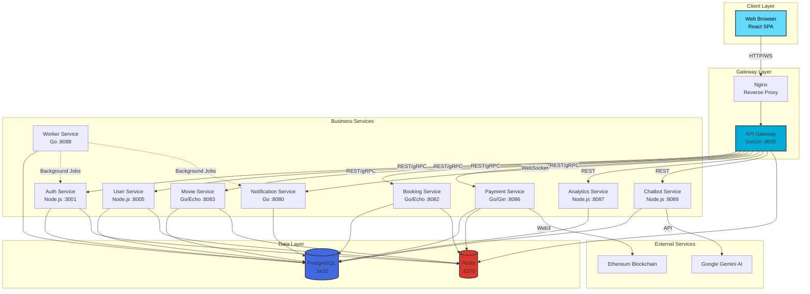

<div align="center">

# 🎬 Cinema Booking System

**Enterprise-grade microservices platform for cinema ticket booking and management**

[](LICENSE)
[](docker-compose.yml)
[](https://go.dev/)
[](https://nodejs.org/)
[](https://react.dev/)
[](https://www.postgresql.org/)

[Getting Started](docs/GETTING_STARTED.md) • [Architecture](docs/ARCHITECTURE.md) • [API Docs](docs/API.md) • [Contributing](docs/CONTRIBUTING.md)

</div>

---

## 📖 Introduction

The **Cinema Booking System** is a full-stack, production-ready platform built with modern microservices architecture. It enables seamless movie browsing, real-time seat selection, secure payment processing (including blockchain), and AI-powered customer support.

### Why This Project?

- **🎯 Real-world complexity**: Demonstrates enterprise patterns including microservices, event-driven architecture, and distributed transactions
- **🚀 Modern tech stack**: Combines Go's performance with Node.js flexibility, React's UI capabilities, and cutting-edge AI/blockchain integration
- **📚 Learning resource**: Comprehensive documentation and clean code structure make it ideal for studying system design
- **🔧 Production-ready**: Includes authentication, authorization, caching, monitoring, and deployment configurations

---

## ✨ Key Features

### For Customers

- **🎥 Movie Discovery**: Browse comprehensive movie catalog with detailed information, trailers, and ratings
- **🪑 Real-time Seat Selection**: Interactive seat map with instant availability updates
- **💳 Flexible Payments**: Support for traditional payment methods and Ethereum blockchain transactions
- **🔔 Live Notifications**: WebSocket-based real-time updates for bookings and payments
- **🤖 AI Chatbot**: Intelligent customer support powered by Google Gemini with RAG (Retrieval Augmented Generation)

### For Staff & Administrators

- **📊 Analytics Dashboard**: Revenue reports, booking statistics, and business insights with interactive charts
- **🎬 Content Management**: Manage movies, showtimes, rooms, and seat configurations
- **👥 User Management**: Role-based access control with granular permissions
- **📈 Performance Monitoring**: Real-time system health and service status tracking

### Technical Highlights

- **⚡ High Performance**: Go-based services with efficient gRPC inter-service communication
- **🔐 Enterprise Security**: JWT authentication, bcrypt password hashing, and RBAC authorization
- **📦 Microservices Architecture**: 10+ independent services for scalability and maintainability
- **🗄️ Advanced Database**: PostgreSQL with pgvector extension for AI embeddings
- **🔄 Event-Driven**: Outbox pattern for reliable asynchronous processing
- **🐳 Containerized**: Full Docker Compose setup for easy deployment

---

## 🏗️ Architecture Overview

The system follows a **microservices architecture** with clear separation of concerns. Each service is independently deployable, scalable, and maintainable.



### Service Responsibilities

| Service | Technology | Port | Responsibilities |
|---------|-----------|------|------------------|
| **API Gateway** | Go/Gin | 8000 | Request routing, authentication, rate limiting, CORS |
| **Auth Service** | Node.js/TypeScript | 3001 | User authentication, JWT generation, session management |
| **User Service** | Node.js/TypeScript | 8005 | User profiles, loyalty points, wallet management |
| **Movie Service** | Go/Echo | 8083 | Movie catalog, genres, showtimes, search |
| **Booking Service** | Go/Echo | 8082 | Ticket reservations, seat management, booking lifecycle |
| **Payment Service** | Go/Gin | 8086 | Payment processing, blockchain integration, refunds |
| **Notification Service** | Go | 8080 | Real-time WebSocket notifications, push messages |
| **Analytics Service** | Node.js/TypeScript | 8087 | Revenue reports, statistics, business intelligence |
| **Chatbot Service** | Node.js/TypeScript | 8089 | AI-powered support, RAG-based knowledge retrieval |
| **Worker Service** | Go | 8088 | Background jobs, event processing, scheduled tasks |

For detailed architecture documentation, see [docs/ARCHITECTURE.md](docs/ARCHITECTURE.md).

---

## 🚀 Quick Start

Get the system running in under 5 minutes:

```bash
# 1. Clone the repository
git clone https://github.com/yourusername/cinema-project.git
cd cinema-project

# 2. Start all services with Docker Compose
docker compose up -d --build

# 3. Run database migrations
cd migrate
go run main.go reset

# 4. Access the application
# Frontend: http://localhost
# API Gateway: http://localhost:8000
```

For detailed installation and setup instructions, see [docs/GETTING_STARTED.md](docs/GETTING_STARTED.md).

---

## 📚 Documentation

Comprehensive documentation is available in the `docs/` directory:

| Document | Description |
|----------|-------------|
| [Getting Started](docs/GETTING_STARTED.md) | Installation, setup, and running instructions |
| [Architecture](docs/ARCHITECTURE.md) | System design, service interactions, and design patterns |
| [API Documentation](docs/API.md) | Complete API reference with examples |
| [Environment Configuration](docs/ENVIRONMENT.md) | Environment variables for all services |
| [Contributing](docs/CONTRIBUTING.md) | How to contribute to the project |
| [Roadmap](docs/ROADMAP.md) | Planned features and product vision |
| [Prerequisites](docs/PREREQUISITES.md) | System requirements and dependencies |

---

## 🛠️ Technology Stack

### Backend
- **Go 1.21+**: High-performance services (API Gateway, Movie, Booking, Payment, Notification, Worker)
- **Node.js 18+**: Business logic services (Auth, User, Analytics, Chatbot)
- **Frameworks**: Gin, Echo (Go), Express (Node.js)
- **ORMs**: Bun (Go), Sequelize (Node.js)

### Frontend
- **React 18**: Single-page application
- **React Router v6**: Client-side routing
- **Tailwind CSS**: Modern styling
- **Axios**: HTTP client
- **Ethers.js**: Blockchain integration
- **Recharts**: Analytics visualization

### Infrastructure
- **PostgreSQL 15**: Primary database with pgvector extension
- **Redis 7.4**: Caching and session management
- **Docker & Docker Compose**: Containerization
- **Nginx**: Reverse proxy and load balancing

### External Services
- **Google Gemini AI**: Chatbot intelligence
- **Ethereum**: Blockchain payments

---

## 🤝 Contributing

We welcome contributions! Please see our [Contributing Guidelines](docs/CONTRIBUTING.md) for details on:

- How to submit pull requests
- Code style guidelines
- Development setup
- Testing requirements

---

## 📄 License

This project is licensed under the **MIT License** - see the [LICENSE](LICENSE) file for details.

---

## 🗺️ Roadmap

See our [Product Roadmap](docs/ROADMAP.md) for planned features including:

- Mobile applications (iOS/Android)
- Payment gateway integrations (Stripe, PayPal)
- Multi-language support
- Kubernetes deployment
- Advanced AI features
- And much more!

---

## 🙏 Acknowledgments

Built with amazing open-source technologies:
[Go](https://go.dev/) • [Node.js](https://nodejs.org/) • [React](https://react.dev/) • [PostgreSQL](https://www.postgresql.org/) • [Redis](https://redis.io/) • [Docker](https://www.docker.com/)

---

<div align="center">

**Built with ❤️ by developers, for developers**

[⬆ Back to Top](#-cinema-booking-system)

</div>
